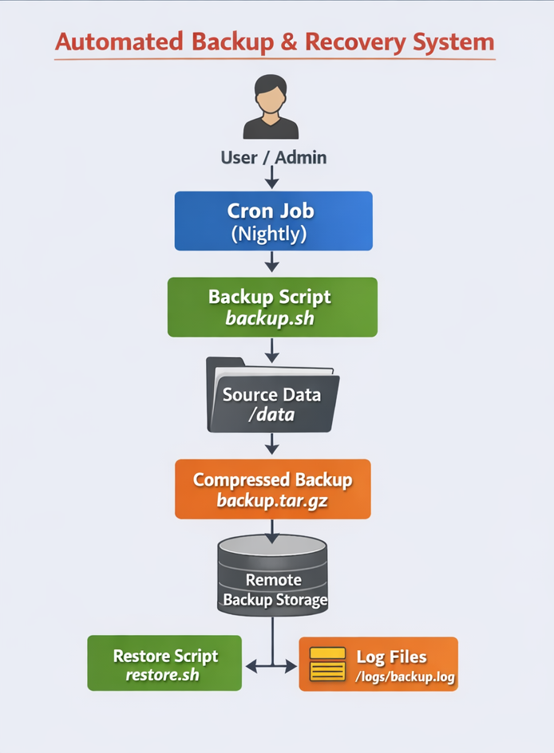

# Automated Linux Backup & Recovery System

## 📌 Project Overview
This project implements an automated Linux backup and recovery system using Bash scripting and cron scheduling.
It is designed to ensure data safety by performing regular backups, storing them in a secondary location,
maintaining logs, and supporting quick data restoration when required.

This project reflects real-world Linux server backup practices used in production environments.

---

## 🎯 Objectives
- Automate daily backups of critical application data
- Compress backups with timestamped filenames
- Store backups in a secondary (remote-like) location
- Maintain logs for backup and upload operations
- Restore data quickly using a dedicated restore script
- Automate execution using cron jobs

---

## 🛠 Tools & Technologies
- Linux (Amazon Linux / CentOS / Ubuntu)
- Bash Scripting
- Cron
- tar (for compression)
- SCP / local secondary storage (for backup upload)

---

## ⚙️ Features
- Automated daily backups
- Timestamped compressed backup files (`.tar.gz`)
- Secondary backup storage for disaster recovery
- Backup and upload logging
- Manual restore capability
- Cron-based scheduling

---

## 📂 Project Structure
/opt/backupsystem
├── backups
│ └── backup_YYYY-MM-DD_HH-MM-SS.tar.gz
├── remote-backup
│ └── backup_YYYY-MM-DD_HH-MM-SS.tar.gz
├── restore
├── logs
│ ├── backup.log
│ └── upload.log
└── scripts
├── backup.sh
├── upload.sh
└── restore.sh

##To restore 
./restore.sh /opt/backupsystem/backups/backup_YYYY-MM-DD_HH-MM-SS.tar.gz

---

## 🕒 Cron Jobs
Daily automated execution using cron:

```bash
# Daily backup at midnight
0 0 * * * /opt/backupsystem/scripts/backup.sh

# Upload backup at 2:30 AM
30 2 * * * /opt/backupsystem/scripts/upload.sh
```

## 🏗 Architecture Diagram



